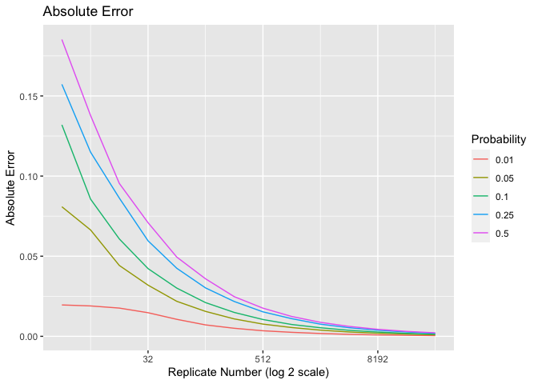
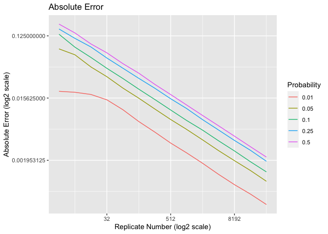

# Looking For a Data Scientist?

Dear Mr.HR Manager, I hear you are looking for a top-notch data
scientist. Well, you’re in luck! In order to convince you why you should
hire me, I am going to discuss one of the spookiest topics in data
science: simulation error. Can we rely on data science to tell us if a
roulette strategy works, or how many people in our class have the same
birthday? Since I am a great data scientist, the easy answer to these
questions is yes. However, I must acknowledge that all simulations are
susceptible to errors. Therefore, the question is HOW large and funky
the error is.

## Why am I admitting that my simualtions have errors?

It would be so much easier if I could simply say that my data models are
perfect and completely reliable, but this would be a false and damaging
statement. Simulations are used to predict all sorts of cooperate
behaviors, such as consumer amounts and market prices. These predictions
are very useful, however, it is still important to remember that
simulations cannot perfectly predict human action. Following the example
of consumer amounts, a simulation would fail if a tick-tock trend
quickly emerged and made an activity or product trendy.

## Concepts Averview

The first two important vocabulary terms to discuss are **probability**
and **estimated probability**. Probability is true the likelihood that
an event occurs and is measured from 1-0, whereas estimated probability
is the likelihood that we determined from our simulation and data. The
second two important terms are **absolute error** and **relative
error**. absolute error is the absolute value of the difference between
estimated probability and probability (|p̂−p| ). It indicates how far off
our estimate was from the true probability and is useful when we want to
understand the accuracy of our simulation’s estimates Relative error is
the absolute error divided by the probability (|p̂−p|/p). It provides an
error relative to the probability so we can assess the accuracy based on
the true probability, so it is useful to understand the scale at which
an error inaccuracy would create damage.

## Error In Action

To demonstrate my amazing data science skills, I have presented a set of
codes to display how simulation errors change over different
probabilities and sample sizes. This code first creates a function to
calculate estimated probability, absolute error, and relative error from
p and p̂. It then runs a for loop in order to iterate through a number of
p values and sample sizes from a 4 X 15 factorial. Finally, the outputs
from the for loop are put into two graphs: One that shows how absolute
error changes with sample size number for each probability and one that
shows how relative error changes with sample size number for each
probability

    # Step 1: calculate estamited probability, absolute error, and relative error
    error_v4 <- function(r,n,p){
      d1 <- rbinom(r,n,p)
      phat <- d1/n
      ae <- abs(phat-p)
      re <- ae/p
      c(mean(ae), mean(re))
    }

    mean_error_v4 <- error_v4(5000, 128, .3)

    # create vectors for probabilities and replicate numbers
    ps <- c(0.01, 0.05, 0.1, 0.25, 0.5)
    ns <- 2^(2:15)

    # create empty vectors to store the errors
    out_ae <- array(NA, dim=c(length(ps), length(ns)))
    out_re <- array(NA, dim=c(length(ps), length(ns)))

    # Step 2: Iterate over the sets probabilties and number of replicates
    for(i in seq_along(ps)){
        for(j in seq_along(ns)){
           out <- error_v4(5000, ns[j], ps[i])
           out_ae[i,j] <- out[1]
           out_re[i,j] <- out[2]  
        }
    }

    # Step 3: Graph the errors

    library(ggplot2)

    # Plotting absolute error
    df_ae <- data.frame(replicates = rep(ns, each = length(ps)),
                        absolute_error = as.vector(out_ae),
                        probabilities = rep(ps, length(ns)))

    ggplot(df_ae, aes(x = replicates, y = absolute_error, color = as.factor(probabilities))) + geom_line() +  scale_x_continuous(trans = 'log2') +  labs(title = "Absolute Error", x = "Replicate Number",   y = "Absolute Error",  color = "Probability")

    # Plotting relative error
    df_re <- data.frame(replicates = rep(ns, each = length(ps)),
                        relative_error = as.vector(out_re),
                        probabilities = rep(ps, length(ns)))

    ggplot(df_re, aes(x = replicates, y = relative_error, color = as.factor(probabilities))) + geom_line() + scale_x_continuous(trans = 'log2') + labs(title = "Relative Error", x = "Replicate Number",  y = "Relative Error", color = "Probability")

# Conclusion

As you can see from the graphs, both absolute and relative error will
decrease and replicate number increases for all probabilities.
Additionally, it is evident that greater probabilities will result in a
larger absolute error but smaller relative error. Due to my immense
understanding of simulation error and how it changes with different
probabilities and replicate numbers, it is clear that I am perfect for
this position and should be hired for the job! *(AKA given an 2 on the
assignment)*
