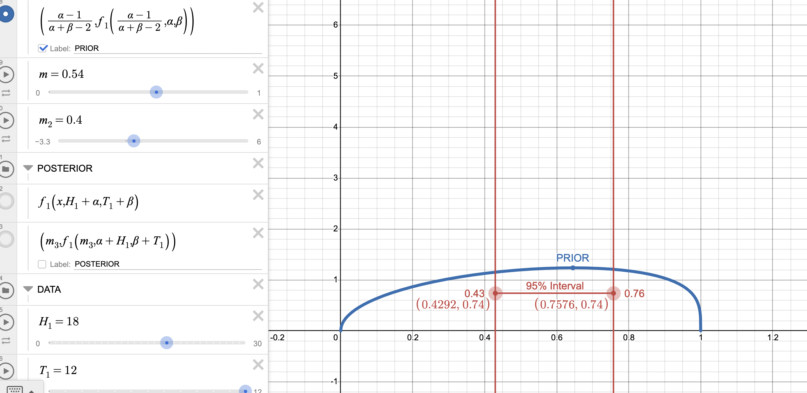
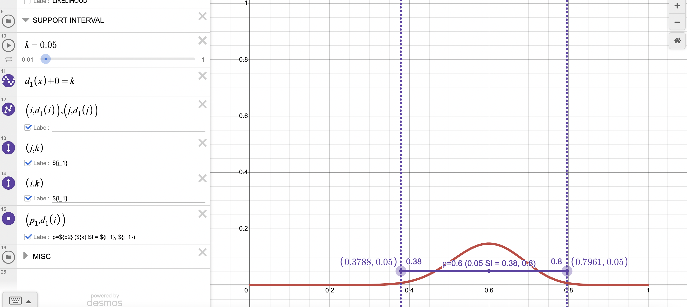
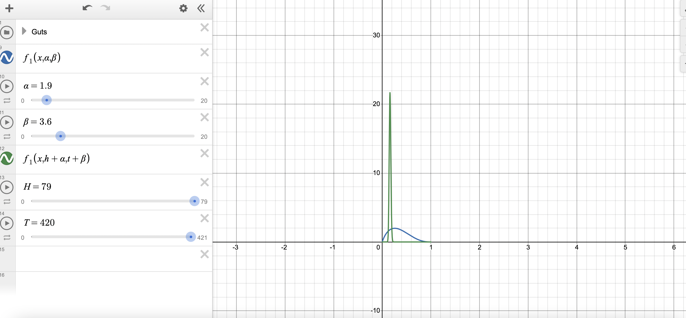
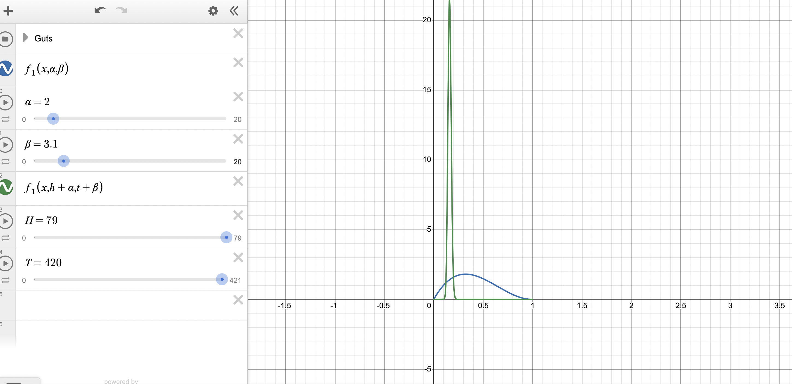

**NOTE:** The `.rmd` version of the file is available here: [(link)](https://tgstewart.cloud/final-exam.rmd)

## Instructions

Please prepare reponses/solutions for the following questions. On the day of the exam, you will be given a new set of questions. You will use the solutions you've prepared for this exam during the exam.

During the exam, you will also be permitted to access the internet for publicly available content. You will not be allowed to communicate with anyone via the internet or any other means during the exam. This includes, but is not limited to:

-   No messaging, emailing, or using social media to contact others.
-   No posting questions or seeking answers on forums, chat rooms, chat bots (including large language models like ChatGPT), or any collaborative platforms.
-   No sharing or discussing exam content with peers through any online or electronic medium.

You may **NOT** discuss any aspect of the exam or prep questions with anyone other than the instructor or TA. You may **NOT** share code or documents.

## Submission instructions

1.  Within your course repo, create a folder called `final-exam`
2.  Within the folder, create the script file `final-exam.rmd` with your solutions. Create a rendered report in `.pdf` output.
3.  Add, commit, and push to your repo on github.com.
4.  If you received an email from gradescope, upload your PDF to gradescope.

## Questions

All questions, including extra credit are 5 pts.

**1.** In the examples below, please explain/define what is meant by the word "probability".

> I think there is an 0.8 probability that the defendent committed the crime.

> The probability of winning the powerball is less than 0.00001.

In these examples, probability refers to the expression of likelyhood that an event will occur. In the first case, we see an expression of beilef probability because a personal belief on whether or not the defendant is guilty is being expressed. In the second example, we see a frequency probability which is determined by calculating long run averages that an event occurs.

**2.** The following table is based on a study of [delivery method and postnatal depression (link)](https://www.ncbi.nlm.nih.gov/pmc/articles/PMC556158/). (You do not need to read the publication.) In a cohort of mothers, researchers collected delivery mode and depression scores (8 weeks postpartum). The data were collected in 1991 and 1992. While some planned vaginal deliveries did result in emergency caesarean section or assisted vaginal delivery, the variable of interest was the **planned** delivery mode.

Suppose that the cell probabilities were provided as $a$, $b$, $c$, and $d$ as in the table below. Complete the rest of the table symbolically.

|                                    | Depression score $<$ 13 | Depression score $\geq$ 13 |     All     |
|:--------------------|:---------------:|:---------------:|:---------------:|
| Planned vaginal delivery           |            a            |             b              |     a+b     |
|   row                              |         a/(a+b)         |          b/(a+b)           |             |
|   col                              |         a/(a+c)         |          b/(b+d)           |             |
| Planned caesarean section delivery |            c            |             d              |     c+d     |
|   row                              |         c/(c+d)         |          d/(c+d)           |             |
|   col                              |         c/(a+c)         |          d/(b+d)           |             |
| All                                |           a+c           |            b+d             | a+b+c+d = 1 |

**3.** Now suppose that rather than cell probabilities, conditional probabilities were collected. Define postnatal depression as a depression score $\geq$ 13, and let

$$
e = P(\text{postnatal depression} | \text{Planned vaginal delivery})
$$

$$
f = P(\text{postnatal depression} | \text{Planned caesarean section delivery})
$$

$$
g = \text{incidence of planned caesarean section}.
$$

Complete the table symbolically.

|                                    |         Depression score $<$ 13          |   Depression score $\geq$ 13   | All |
|:--------------------|:---------------:|:---------------:|:---------------:|
| Planned vaginal delivery           |             (1-g)-((1-g)\*e)             |           (1-g) \*e            | 1-g |
|   row                              |          (1-g)-((1-g)\*e)/(1-g)          |               e                |     |
|   col                              | (1-g)-((1-g)*e)+g-(g*f)/(1-g)-((1-g)\*e) | ((1-g) *e)/ ((1-g)* e)+ (g\*f) |     |
| Planned caesarean section delivery |                 g-(g\*f)                 |              g\*f              |  g  |
|   row                              |               (g-(g\*f))/g               |               f                |     |
|   col                              |  (g-(g*f))/ ((1-g)-((1-g)*e)+g-(g\*f))   |    (g*f)/((1-g)* e)+ (g\*f)    |     |
| All                                |         (1-g)-((1-g)*e)+g-(g*f)          |       ((1-g) *e)+ (g*f)        |     |

**4.** (Continuing from the previous problem.) If planned caesarean section is 30% of all deliveries, and the risk of postnatal depression is 0.1 in the planned vaginal delivery group and 0.15 in planned caesarean section delivery groups, what is

$$
P(\text{Planned caesarean section delivery} \vert \text{Depression score } < 13)?
$$

We are looking for (g-(g*f))/ ((1-g)-((1-g)*e)+g-(g\*f)), which is a conditional column probability off the table. We are given that g = .3, e = .1, f = .15.

```{r}
g <- .3
e <- .1
f <- .15
prob <- (g-(g*f))/((1-g)-((1-g)*e)+g-(g*f))
prob
```

**5.** Suppose observational data were collected in which depression rates matched the proportions in question **4**. Would the data support the conclusion that caesarean section delivery leads to higher rates of depression? If not, why not? (Hint: Recall chapter 8 of the text "Understanding Uncertainty".)

**6.** The Monte Hall problem is a classic game show. Contestants on the show where shown three doors. Behind one randomly selected door was a sportscar; behind the other doors were goats.

At the start of the game, contestants would select a door, say door A. Then, the host would open either door B or C to reveal a goat. At that point in the game, the host would ask the contestant if she would like to change her door selection. Once a contestant decided to stay or change, the host would open the chosen door to reveal the game prize, either a goat or a car.

In this problem, consider a **modified** version of the Monte Hall problem in which the number of doors is **variable**. Rather than 3 doors, consider a game with 4 or 5 or 50 doors. In the modified version of the game, a contestant would select an initial door, say door A. Then, the host would open **one** of the remaining doors to reveal a goat. At that point in the game, the host would ask the contestant if she would like to change her door selection. Once a contestant decided to stay or change, the host would open the chosen door to reveal the game prize, either a goat or a car.

Consider two strategies:

1.  Always stay with the first door selected.
2.  Always switch to the unopened door.

The function `game` below plays a single game of Monte Hall. The function returns a vector of length two, the first element is the prize under strategy 1 and the second element is the prize under strategy 2. The function has a single input parameter, N, which is the number of doors in the game.

Use the `game` function to estimate the probability that strategy 1 results in a goat and strategy 2 results in a car. Let **N=5**.

```{r}
suppressPackageStartupMessages(require(magrittr))
suppressPackageStartupMessages(require(dplyr))

game <- function(N){
  if(N<3) stop("Must have at least 3 doors")
  prize <- sample(c(rep("goat",N-1),"car"), N)
  guess <- sample(1:N,1)
  game <- data.frame(door = 1:N, prize = prize, stringsAsFactors = FALSE) %>% 
    mutate(first_guess = case_when(
      door == guess ~ 1
      , TRUE ~ 0
    )) %>% 
    mutate(potential_reveal = case_when(
        first_guess == 1 ~ 0
      , prize == "car" ~ 0
      , TRUE ~ 1
    )) %>% 
    mutate(reveal = 1*(rank(potential_reveal, ties.method = "random") == 3)) %>% 
    mutate(potential_switch = case_when(
      first_guess == 1 ~ 0
      , reveal == 1 ~ 0
      , TRUE ~ 1
    )) %>% 
    mutate(switch = 1*(rank(potential_switch, ties.method = "random") == 3))
  c(game$prize[game$first_guess == 1], game$prize[game$switch == 1])
}
# we want the proportion of games in which goat is the first word and also the proportions for which car is the second word
# create a table with proportions
R <- replicate(10000, game(5) |> paste(collapse = ""))
table(R) |> proportions() 
# Probability of strategey 1 resulting in a goat: goatcar + goatgoat = 0.2761 + 0.5288 = 0.8049

# Probability of strategey 2 resulting in a car:  goatcar = 0.2761 
```

**7**. Consider the following tree, a possible analytic solution proposed by your classmate for the Monte Hall game with $N$ doors. Your classmate argues that at the start of the game, there is only $\frac{1}{N}$ chance of getting the car in the initial guess. Consequently, there is a $\frac{N-1}{N}$ of selecting a goat in the initial guess. The initial guess is the outcome of strategy 1.

If strategy 1 results in a goat, then the outcome of strategy 2 is either a goat or car. As the host as revealed a door with a goat behind it, there are N-2 doors to choose from, 1 of which hides a car and N-3 of which hide goats. (Or so your classmate argues.)

Likewise, your classmate argues that if strategy 1 results in a car, then the outcome of strategy 2 must be a goat.

Multiplying the probabilities along the pathway, your classmate argues, generates the probability of the path itself.

```{r, echo = FALSE,fig.width=20,fig.height=12,out.width="80%"}
plot.new()
plot.window(xlim = c(0,3.5), ylim  = c(.5,4.5))
points(0,2.5,pch=16,cex=8)
lines(c(0,1,2,NA,1,2,NA,0,1,2,NA,1,2), c(2.5,3.5,4,NA,3.5,3,NA,2.5,1.5,1,NA,1.5,2), lwd = 6)
points(1,3.5,cex=16, pch = 16)
points(1,3.5,cex=14, pch = 16, col = "white")
text(1,3.5,"G", cex = 5)
points(.5,3,pch=16,col = "white",cex = 16)
text(.5,3,expression(frac("N-1","N")),cex = 2)

points(1,1.5,cex=16, pch = 16)
points(1,1.5,cex=14, pch = 16, col = "white")
text(1,1.5,"C", cex = 5)
points(.5,2,pch=16,col = "white",cex = 16)
text(.5,2,expression(frac(1,"N")),cex = 2)

points(2,4,cex=16, pch = 16)
points(2,4,cex=14, pch = 16, col = "white")
text(2,4,"G", cex = 5)
points(1.5,3.75,pch=16,col = "white",cex = 16)
text(1.5,3.75,expression(frac("N-3","N-2")),cex = 2)

points(2,3,cex=16, pch = 16)
points(2,3,cex=14, pch = 16, col = "white")
text(2,3,"C", cex = 5)
points(1.5,3.25,pch=16,col = "white",cex = 16)
text(1.5,3.25,expression(frac(1,"N-2")),cex = 2)

points(2,2,cex=16, pch = 16)
points(2,2,cex=14, pch = 16, col = "white")
text(2,2,"G", cex = 5)
points(1.5,1.75,pch=16,col = "white",cex = 16)
text(1.5,1.75,"1",cex = 2)

points(2,1,cex=16, pch = 16)
points(2,1,cex=14, pch = 16, col = "white")
text(2,1,"C", cex = 5)
points(1.5,1.25,pch=16,col = "white",cex = 16)
text(1.5,1.25,"0",cex = 2)

text(2.5,4,expression(frac("(N-1)(N-3)","N(N-2)")), cex = 2, pos = 4)
text(2.5,3,expression(frac("N-1","N(N-2)")), cex = 2, pos = 4)
text(2.5,2,expression(frac("1","N")), cex = 2, pos = 4)
text(2.5,1,"0", cex = 2, pos = 4)

text(1,4.5,"Strategy 1", cex = 2)
text(2,4.5,"Strategy 2", cex = 2)
```

The joint distribution of the outcomes of strategy 1 and strategy 2 can be represented, then, with the following contingency table.

|            |      |      Statragy 2      |                             |
|:-----------|:-----|:--------------------:|:---------------------------:|
|            |      |         Car          |            Goat             |
| Statragy 1 | Car  |          0           |        $\frac{1}{N}$        |
|            | Goat | $\frac{N-1}{N(N-2)}$ | $\frac{(N-1)(N-3)}{N(N-2)}$ |

Using simulation, check the solution of your classmate for N=5. Show the contingency table which results from simulation next to the proposed analytic solution proposed by your classmate. How well does the simulation solution match the proposed solution?

it matches perfectly with the car/car estimation of 0, 1/5 = .2 for car/goat which sort of matches .11, for goat car 4/5\*3 = 4/15 = .266 which sort of matches .36 , and for goat goat = .53 which matches very well with the table, which also gave .53

```{r}
# we need to generate a bunch of replications of the game and create a contigency table based on of results of those replicates 
# we need to store data from the replications in a data frame 
library(gmodels)
a1 <- replicate(100, game(5))
gmodels::CrossTable(a1[1, ], a1[2, ])


```

**8**. Calculate the relative and absolute simulation error of your simulated probability in question **6**, supposing that the your classmate's solution in question **7** is correct.

abosulte error = \|simultaion - actual\|

for car/car and goat/goat error is zero abs error car/goat = .11 - .2 = .09 abs error goat/car = .36 - .266 = 0.094

relative error = abosulte error/ actual rel error car/goat = .09/.2 = .45 rel error goat/car = 0.094/ .266 = 0.3533835

**9.** Consider a test for a rare genetic condition. Let T+ denote a test result that indicates the condition is present, while T- denotes absence. Let D+ and D- denote the true status of the disease.

Using the following information,

-   P(T+\|D+) = .85, and - sensititvity
-   P(T-\|D-) = .95, and - specifcity
-   P(D+) = 0.001 - prevelence

calculate the **negative** predictive value of the test, P(D-\|T-).

|        | Disease + | Disease - |        |
|:-------|:---------:|:---------:|:------:|
| Test + |           |           |        |
| → cell |  0.00085  |  0.04995  | 0.0508 |
| → row  |           |           |        |
| → col  |    .85    |    .05    |        |
| Test - |           |           |        |
| → cell |  0.00015  |  0.94905  | 0.9492 |
| → row  |           | 0.999842  |        |
| → col  |    .15    |    .95    |        |
|        |   .001    |   .999    |   1    |

the NPV is a conditional row probability where we are given a negative test and determining if that means we dont have the disease. We can use the rules of probability to fill in the table given conditional row probabilities and a marginal probabiliy. The NPV is equal to 0.999842

**10.** Create a plot that shows how the **positive** predictive value is a function of the prevalence of disease, P(D+). Keep the sensitivity and specificity the same as the previous question.

```{r}
# ppv = (D+, T+)/ (T+) because it is a conditional row probability 
# (D+, T+) = prev * sesitivity
# (T+) = ((1 - prev) * (1 - specificty)) + (D+, T+) 
sen <- .85
spec <- .95
prev <- seq(.001, .999, .001)
cellprob <- prev * sen
tpos <- ((1- prev) * (1 - spec)) + cellprob 
ppv <- cellprob/ tpos
plot(prev, ppv, main= "Positive Predictive Value as a function of Prevelence") 


```

**11.** Suppose an upcoming election for UVA student body president is between two candidates. In a survey of 30 students, 18 voiced support for candidate A. Use the Desmos [calculator (link)](https://www.desmos.com/calculator/rayscxmk2t) to fit a probability model with Bayesian methods for the election, specifically the probability that candidate A is the prefered by the student body. Report the 95% credible interval. (Provide a screen shot of the calculator with your solution.)

First I set my prior knowledge, which I changed slightly from what was given. Then I set my H as 18 and my T as 12 to represent how many people voted for canidates A and B. Then I moved the credible interval bar untill it equaled 95%



**12.** Suppose an upcoming election for UVA student body president is between two candidates. In a survey of 30 students, 18 voiced support for candidate A. Use the Desmos [calculator (link)](https://www.desmos.com/calculator/xxxskep7rj) to fit a probability model with Maximum Likelihood for the election, specifically the probability that candidate A is the prefered by the student body. Report the 1/20 support interval. (Provide a screen shot of the calculator with your solution.)

Since Max Liklihood does not require a prior, the first step was to set n = 30 and h = 18. then I set the support interval to k = 1/20 = .05.




**13.** Suppose diastolic blood pressure (DBP) follows a normal distribution with mean 80 mmHg and SD 15 mmHg. What is the probability that a randomly sampled person's DBP exceeds 104 mmHg?

```{r}
# we want the probability of greater than 104 - complment to that is less than or equal to 104
# use 1 - pnorm to determine 

1 - pnorm(104, 80, 15)
```

**14.** Suppose a laptop manufacturer sourced batteries from two different vendors. In testing the batteries, the manufacturer collected the following data on time to battery depletion.

```{r}
d1 <- readRDS(url("https://tgstewart.cloud/battery-data.RDS"))
head(d1)
```

Using the data, generate a plot of the empirical CDF for time to battery depletion for each vendor. (Generate both eCDFs on the same plot, if possible.)

```{r}
v1 <- d1 %>% filter(source == 0) |> pull(time) 


v2 <- d1 %>% filter(source == 1) |> pull(time) 
a2 <- ecdf(v2)
a1 <- ecdf(v1) 
plot(a1)
plot(a2)


```

**15.** Based on the data, what is the 80th percentile for battery life (time to battery depletion) for each vendor?

use the quantile function which is the inverse of the eCDF to get the 80th percentile:

```{r}

ps <- ppoints(1000)
q1 <- quantile(v1, ps)
plot(ps, q1, main = "estimate for 80th percentile vendor 1")
abline(v = .8)

q2 <- quantile(v2, ps)
plot(ps, q2, main = "estimate for 80th percentile vendor 2")
abline(v = .8)
```

**16.** Using the data, generate a histogram for time to battery depletion for each vendor. (Generate both histograms on the same plot, if possible.)

```{r}
# Hints for plot
b1 <- d1$time %>% range %>% `+`(c(-1,1))
b2 <- seq(b1[1], b1[2], length=100)

# Source 1
hist(v1, breaks = b2, freq = FALSE, col = "#1338BE20", xlim = b1)

# Source 2
hist(v2, breaks = b2, add=TRUE, col = "#FF573320", freq = FALSE)
```

**17.** The function `rbatlife` was created to mimic the distribution of battery life from the previous problem. It will generate `N` draws from the distribution. Using `rbatlife`, what is the mean battery life for each vendor?

```{r}
rbatlife <- function(N){
    g <- rbinom(N,1,.4)
    o <- rgamma(N,3,scale=4)*g + rnorm(N,12,3)*(1-g)
    data.frame(source = g, time = o)
}

# use this fucntion with v1 and v2 to along with the mean() fucntion to determine mean battery life for each vendor
```

**18.** The following code will load the first 500 rows of the NHANES data, a large national survey about nutrition.

```{r}
#install.packages("Hmisc")
library(Hmisc)
suppressPackageStartupMessages(require(dplyr))
Hmisc::getHdata(nhgh)
d1 <- nhgh[1:500,]
head(d1)

summary(d1)
table(d1$dx)
```

Estimate the prevalence of diabetes (dx) for all respondents using Bayesian updating with a binomail likelihood and beta prior. Use the following [Desmos calculator (link)](https://www.desmos.com/calculator/l8hjdvetnk). Change $\alpha$ and $\beta$ to control the prior. Use $H$ (heads) and $T$ (tails) to plug in the data. Take a screenshot of the posterior distribution and the prior.



**19.** Reestimate the prevalence of diabetes (dx) with a more informative prior. Take a screenshot of the resulting posterior distribution with the new prior. Explain why the new prior is more informative.

I udpated the prior based on what I would assume to be true in society about diabetes, and I would assume not many people have it but many would in the study but is why i increased a by a little bit. The new prior is more informative because it aligns more closely with my prior beiefs and more acurate prior beielfs and therefore some uncertanity is eliminated



**20.** Suppose the posterior distribution of the mean birthweight of infants whose mothers did not smoke was a normal distribution with mean = 3100 and standard deviation = $\sqrt{10}$. The symmetric density credible interval is calculated by identifying the 0.025 and 0.975 quantiles from the posterior. Calculate the interval.

```{r}
pnorm(0.025,3100,sqrt(10))
qnorm(0.975, 3100, sqrt(10)) - qnorm(.025, 3100, sqrt(10))
```

**EC1.** A creative writting essay was submitted without the author's name. After informing the class of the unnamed essay, two students claimed to be the author. Student A is known to use exclamation points in 10% of sentences. Student B is known to use exlamation points in 5% of sentences. A review of the unnamed essay revealed that 5 of 60 sentences used an exlamation point. With this information, calculate

$$
P(\text{Student A authored the essay }\vert \text{5 of 60 sentences used an exlamation point}).
$$

**EC2.** Continuing the previous question, create a plot with number of exclamation points on the x-axis and the probability that student A authored the essay on the y-axis.

**EC3.** (Continuing problems 14 - 17) If a battery lasted for 10 or fewer hours, what is the probability it was from source 1?

```{r}
# the probability within source 1 itself would be just over .2 and around .4 for source 2. 
plot(a1)
abline(v=10)
plot(a2)
abline(v=10)
```
