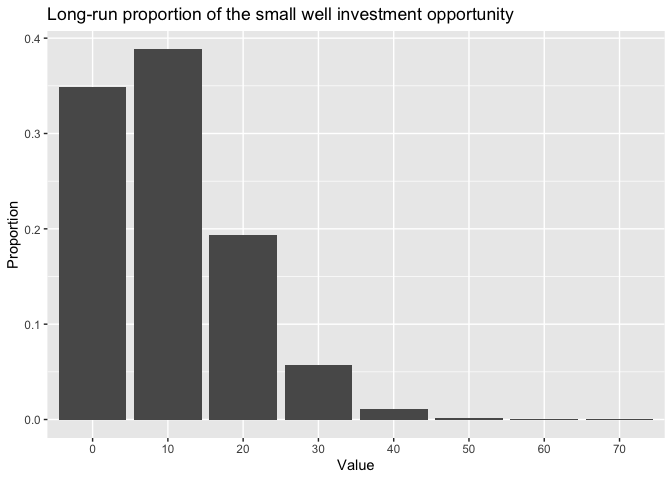

    big_well <- function(N) 100*rbinom(N, 1, 0.1)
    sma_well <- function(N)  10*rbinom(N, 10, 0.1)

    set.seed(23459874) # What does set.seed do?
    big_well(10)

    ##  [1] 100 100   0   0   0   0   0   0   0   0

    ##  [1] 100 100   0   0   0   0   0   0   0   0

    sma_well(10)

    ##  [1] 10  0  0 10  0  0  0  0 20  0

    ##  [1] 10  0  0 10  0  0  0  0 20  0

    big_well(1E6) |> 
      table() 

    ## 
    ##      0    100 
    ## 899848 100152

    ## 
    ##      0    100 
    ## 899848 100152

    big_well(1E6) |>
      table() |>
      proportions()

    ## 
    ##       0     100 
    ## 0.90008 0.09992

    ## 
    ##       0     100 
    ## 0.90008 0.09992

# 1: Write code that generates the long-run proportions for the small well investment opportunity.

    sma_well(1E6) |>
      table() |>
      proportions()

    ## 
    ##        0       10       20       30       40       50       60       70 
    ## 0.349025 0.387323 0.193557 0.057226 0.011172 0.001553 0.000137 0.000006 
    ##       80 
    ## 0.000001

# 2: Create a figure which visualizes the long-run proportions

    # new package needed 
    # install.packages("ggplot2")
    library(ggplot2)

    # place proportions into a new variable 

    sma_proportions <- sma_well(1E6) |>
      table() |>
      proportions()

    # create a data frame to input into a table

    sma_df <- data.frame(value = as.numeric(names(sma_proportions)),
                         proportion = as.numeric(sma_proportions))
    # use ggplot to graph

    ggplot(sma_df, aes(x = factor(value), y = proportion)) +
      geom_bar(stat = "identity") +
      labs(title = "Long-run proportion of the small well investment opportunity",
           x = "Value",
           y = "Proportion")

# Questions on Chapter 3

## 1

K represents knowledge. An example of how K can change probabilty how be
initally thinking I will go to class, and this would change once I knew
it was going to rain, because my chances of wanting to go to class would
decrease.

## 2

Ec represents a set of outcomes that are not E. Ec is all other
outcomes. Another way to think about Ec would be as a compliment to
event E.

## 3

The P(E is odd) would be 0.4, because there are only two options, odd or
even.
