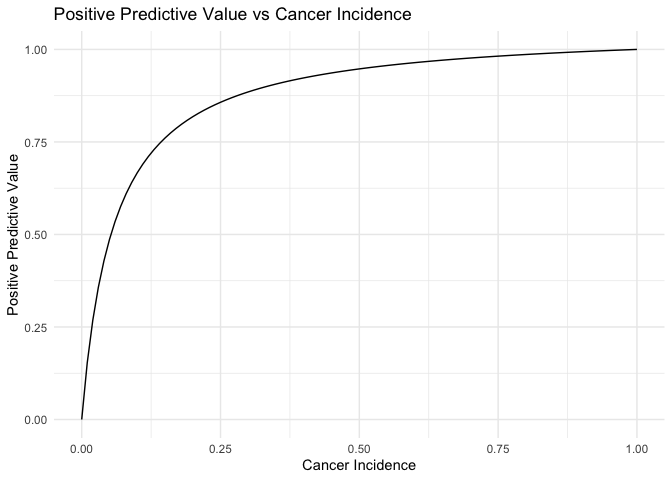

# 1

<table>
<colgroup>
<col style="width: 14%" />
<col style="width: 38%" />
<col style="width: 38%" />
<col style="width: 8%" />
</colgroup>
<thead>
<tr class="header">
<th style="text-align: left;"></th>
<th style="text-align: center;">Cancer</th>
<th style="text-align: center;">Not Cancer</th>
<th style="text-align: center;"></th>
</tr>
</thead>
<tbody>
<tr class="odd">
<td style="text-align: left;">Test = +</td>
<td style="text-align: center;">.009,row=.04, col(tp)=.9,</td>
<td style="text-align: center;">.198 , row=.96, col=.2</td>
<td style="text-align: center;">.207</td>
</tr>
<tr class="even">
<td style="text-align: left;">Test = -</td>
<td style="text-align: center;">.001 , row=.001, col=.1</td>
<td style="text-align: center;">.792, row=.99, col(tn)=.8</td>
<td style="text-align: center;">.793</td>
</tr>
<tr class="odd">
<td style="text-align: left;"></td>
<td style="text-align: center;">P= 0.01</td>
<td style="text-align: center;">.99</td>
<td style="text-align: center;">1</td>
</tr>
</tbody>
</table>

Here is the table with only symbols in terms of tp, tn , and p

<table>
<colgroup>
<col style="width: 25%" />
<col style="width: 25%" />
<col style="width: 25%" />
<col style="width: 25%" />
</colgroup>
<thead>
<tr class="header">
<th></th>
<th>Cancer</th>
<th>Not Cancer</th>
<th>Total</th>
</tr>
</thead>
<tbody>
<tr class="odd">
<td>Test +</td>
<td><em>t</em><em>p</em>(<em>p</em>)</td>
<td>(1−<em>t</em><em>n</em>)(1−<em>p</em>)</td>
<td><em>t</em><em>p</em>(<em>p</em>) + (1−<em>t</em><em>n</em>)(1−<em>p</em>)</td>
</tr>
<tr class="even">
<td>    Row</td>
<td>$\frac{tp(p)}{tp(p) + (1-tn)(1 -
p)}$</td>
<td>$\frac{(1-tn)(1-p)}{tp(p) + (1-tn)(1 -
p)}$</td>
<td></td>
</tr>
<tr class="odd">
<td>    Col</td>
<td><em>t</em><em>p</em></td>
<td>1 − <em>t</em><em>n</em></td>
<td></td>
</tr>
<tr class="even">
<td>Test -</td>
<td>(1−<em>t</em><em>p</em>)<em>p</em></td>
<td>(<em>t</em><em>n</em>)(1−<em>p</em>)</td>
<td>(1−<em>t</em><em>p</em>)<em>p</em> + <em>t</em><em>n</em>(1−<em>p</em>)</td>
</tr>
<tr class="odd">
<td>    Row</td>
<td>$\frac{(1-tp)p}{(1-tp)p + tn(1 -
p)}$</td>
<td>$\frac{(tn)(1-p)}{(1-tp)p + tn(1 -
p)}$</td>
<td></td>
</tr>
<tr class="even">
<td>    Col</td>
<td>1 − <em>t</em><em>p</em></td>
<td><em>t</em><em>n</em></td>
<td></td>
</tr>
<tr class="odd">
<td>Total</td>
<td><em>p</em></td>
<td>1 − <em>p</em></td>
<td>1</td>
</tr>
</tbody>
</table>

\#2

This is a conditional row probability. the probability of P(Cancer|+) =
.04

\#3

    library(ggplot2)

    tp <- .9 
    tn <- .95
    p_values <- seq(0, 1, by=0.01)

    ppv_values = (p_values * tp) / (p_values * tp + (1 - p_values) * (1 - tn))

    df <- data.frame(Cancer_Incidence = p_values, Positive_Predictive_Value = ppv_values)

    ggplot(df, aes(x = Cancer_Incidence, y = Positive_Predictive_Value)) +
      geom_line() +
      labs(title = 'Positive Predictive Value vs Cancer Incidence',
           x = 'Cancer Incidence',
           y = 'Positive Predictive Value') +
      theme_minimal()

