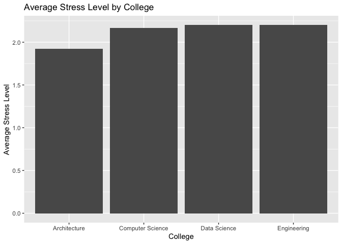
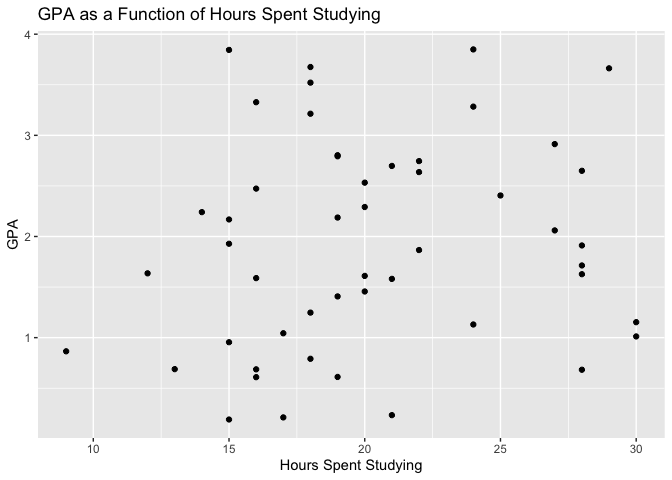
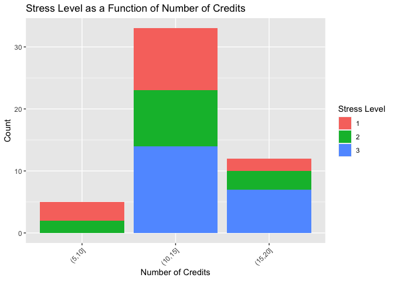

\#1 Below, I have created a sample data set of 50 students at UVA and
stats about them. my binary variable is enrollment status , my nomial
varibale is college, my ordinal variable is stress level, my interval
variable gpa (0 is arbitrary), and my ratio variable is hours spent
studying.

    set.seed(123)

    num_students <- 50
    enrollment_status <- sample(c("Full-time", "Part-time"), num_students, replace = TRUE)
    college <- sample(c("Engineering", "Architecture", "Computer Science", "Data Science"), num_students, replace = TRUE)
    credits <- sample(9:17, num_students, replace = TRUE)
    gpa <- runif(num_students, min = 0, max = 4)
    hours_studying <- rpois(num_students, lambda = 20)  
    stress_level <- sample(c(1, 2, 3), num_students, replace = TRUE)

    students_df <- data.frame(
      Enrollment_Status = enrollment_status,
      College = college,
      Credits = credits,
      GPA = gpa,
      Hours_Studying = hours_studying
    )

    write.csv(students_df, "students_data.csv", row.names = FALSE)

\#2 Now I will analyze different aspects of the data frame. Below, I
have created graphs that show stress level in each college, gpa has a
function of hours spent studying, and stress level as a function of the
number of credits. becuase I created a random set of data, these graphs
may not follow are assumptions based on our knowledge. However, I think
this is an important lesson because data will not always yield the
expected results. For the final graph, I had to use the concept we
discussed in class and turn the number of credits into discrete
categories in order to make a legible bar graph.

    library(ggplot2) 

    ggplot(students_df, aes(x = College, y = stress_level)) +
      geom_bar(stat = "summary", fun = "mean") +
      labs(title = "Average Stress Level by College",
           x = "College",
           y = "Average Stress Level") 

    ggplot(students_df, aes(x = Hours_Studying, y = GPA)) +
      geom_point() +
      labs(title = "GPA as a Function of Hours Spent Studying",
           x = "Hours Spent Studying",
           y = "GPA")

    students_df$Credits_group <- cut(students_df$Credits, breaks = c(0, 5, 10, 15, 20))

    ggplot(students_df, aes(x = Credits_group, fill = factor(stress_level))) +
      geom_bar() +
      labs(title = "Stress Level as a Function of Number of Credits",
           x = "Number of Credits",
           y = "Count",
           fill = "Stress Level") +
      theme(axis.text.x = element_text(angle = 45, hjust = 1))

