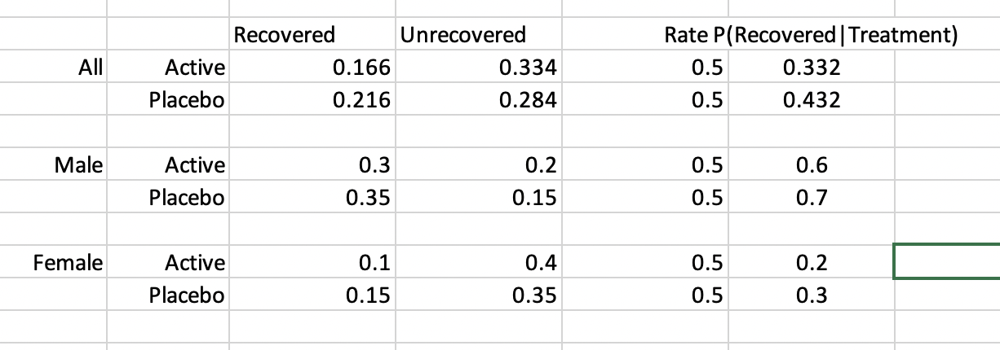
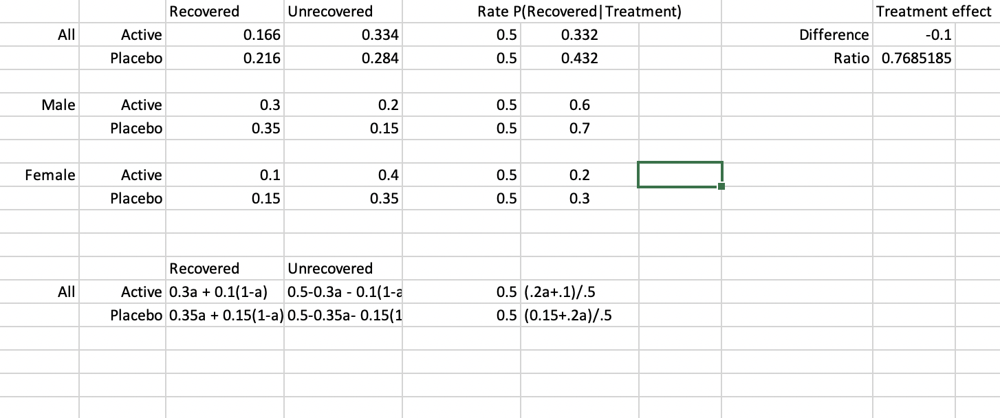

#1
Contingency table when treatment is balanced:


#2

If men are twice as likely to join the trial:




#3

The $\Delta$ (difference) is on the absolute scale and the $\rho$ is the relative scale. This is because $\rho$ is a ratio which are relative.

#4

$\Delta$ and $\rho$ are shown below of senario 1 and 2:




As you change the percent of men, we can see that the treatment on the absolute scale $\Delta$ stays the same. Why $\Delta$ always stays the same shown mathmatically:

(.2a+.1)/.5 - (.15+.2a).5 = (.1 -.15 )/.5 = -.05/.5 = -.1 

The -.1 is the $\Delta$ that we used the graph to calulate. The a cancles out when taking the difference but not when taking the ratio. 

#5

the results were different even though that data was the same, because in the agricultural exampe the right things was not stratification by height. . The only thing the planters could controll was if they use black or white seeds which would impact hieght, which would then impact the yeild. Species and hieght will both impact the yield, but species is the only thing researchers can impact. In the treatment example, sex can be controlled so therefore sex is not on the pathway between treatment and recovery, whereas height is on the pathway to yeild. Height was not a confounding variable as sex was. 

#6

Variety impacts height, and not the other way around. 


#7

anwser to question without coding: 50 get treatment 50 dont - enforce balance amoung diabetes group by. take half of the diabetic group and assign them treatment 1 and half treatment 2. then take the other 75 cards and split in half. then we can shuffle each seperate pile and radnomize them so esnure the we have created balance between the two groups

```{r}
# Create two "decks of cards"
diab <- rep(1:2, times = c(12,13))
notdiab <- rep(1:2, times = c(38,37))

# Shuffle the cards
deck_diab <- sample(diab,25)
deck_notdiab <- sample(notdiab, 75)

# put into a table
group <- rep(c("diab","not diab"), times = c(25,75))

table_diabs <- data.frame(
  group = group,
  assignment = c(deck_diab, deck_notdiab)
)

 #table version 2
data.frame(
  diab = c(deck_diab, rep(NA, 50)),
  not_diab = deck_notdiab
)
```
