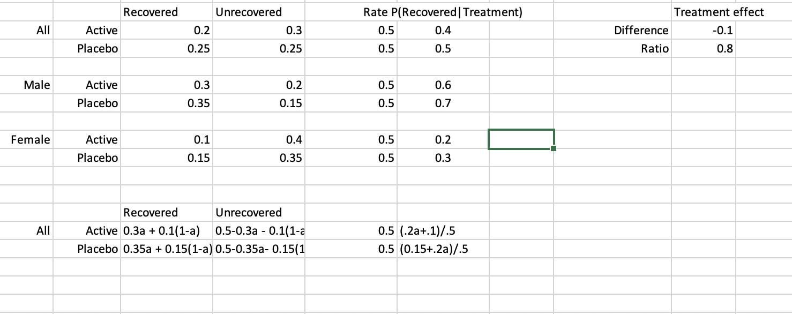
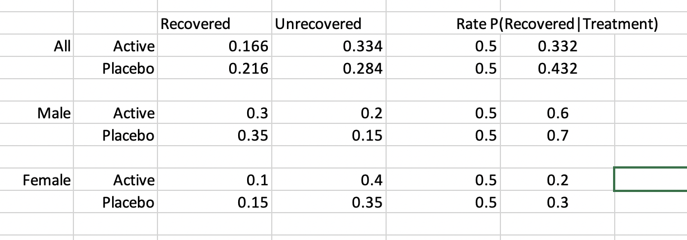
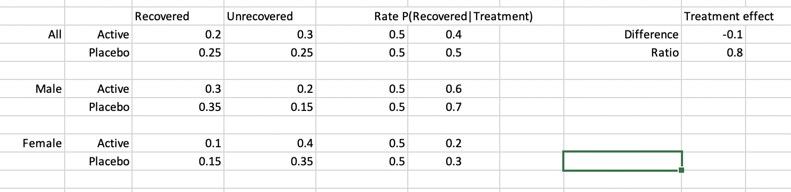
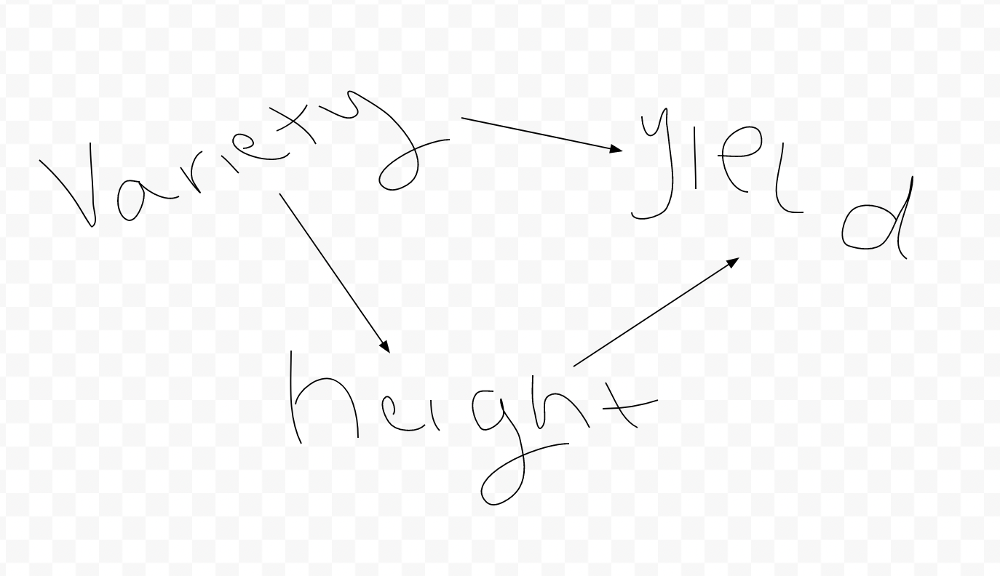

\#1 Contingency table when treatment is balanced: 

\#2

If men are twice as likely to join the trial:

\#3

The *Δ* (difference) is on the absolute scale and the *ρ* is the
relative scale. This is because *ρ* is a ratio which are relative.

\#4

*Δ* and *ρ* are shown below of senario 1 and 2:

As you change the percent of men, we can see that the treatment on the
absolute scale *Δ* stays the same. Why *Δ* always stays the same shown
mathmatically:

(.2a+.1)/.5 - (.15+.2a).5 = (.1 -.15 )/.5 = -.05/.5 = -.1

The -.1 is the *Δ* that we used the graph to calulate. The a cancles out
when taking the difference but not when taking the ratio.

\#5

the results were different even though that data was the same, because
in the agricultural exampe the right things was not stratification by
height. . The only thing the planters could controll was if they use
black or white seeds which would impact hieght, which would then impact
the yeild. Species and hieght will both impact the yield, but species is
the only thing researchers can impact. In the treatment example, sex can
be controlled so therefore sex is not on the pathway between treatment
and recovery, whereas height is on the pathway to yeild. Height was not
a confounding variable as sex was.

\#6

Variety impacts height, and not the other way around.

\#7

anwser to question without coding: 50 get treatment 50 dont - enforce
balance amoung diabetes group by. take half of the diabetic group and
assign them treatment 1 and half treatment 2. then take the other 75
cards and split in half. then we can shuffle each seperate pile and
radnomize them so esnure the we have created balance between the two
groups

    # Create two "decks of cards"
    diab <- rep(1:2, times = c(12,13))
    notdiab <- rep(1:2, times = c(38,37))

    # Shuffle the cards
    deck_diab <- sample(diab,25)
    deck_notdiab <- sample(notdiab, 75)

    # put into a table
    group <- rep(c("diab","not diab"), times = c(25,75))

    table_diabs <- data.frame(
      group = group,
      assignment = c(deck_diab, deck_notdiab)
    )

     #table version 2
    data.frame(
      diab = c(deck_diab, rep(NA, 50)),
      not_diab = deck_notdiab
    )

    ##    diab not_diab
    ## 1     1        2
    ## 2     2        2
    ## 3     1        1
    ## 4     1        2
    ## 5     2        1
    ## 6     2        2
    ## 7     1        2
    ## 8     1        1
    ## 9     1        1
    ## 10    2        1
    ## 11    1        1
    ## 12    2        2
    ## 13    1        2
    ## 14    2        2
    ## 15    2        1
    ## 16    1        1
    ## 17    2        2
    ## 18    1        2
    ## 19    2        1
    ## 20    1        1
    ## 21    1        1
    ## 22    2        2
    ## 23    2        1
    ## 24    2        2
    ## 25    2        2
    ## 26   NA        2
    ## 27   NA        2
    ## 28   NA        2
    ## 29   NA        1
    ## 30   NA        1
    ## 31   NA        2
    ## 32   NA        2
    ## 33   NA        2
    ## 34   NA        1
    ## 35   NA        1
    ## 36   NA        2
    ## 37   NA        1
    ## 38   NA        1
    ## 39   NA        2
    ## 40   NA        1
    ## 41   NA        1
    ## 42   NA        1
    ## 43   NA        2
    ## 44   NA        1
    ## 45   NA        1
    ## 46   NA        2
    ## 47   NA        1
    ## 48   NA        1
    ## 49   NA        2
    ## 50   NA        1
    ## 51   NA        1
    ## 52   NA        1
    ## 53   NA        1
    ## 54   NA        2
    ## 55   NA        2
    ## 56   NA        1
    ## 57   NA        1
    ## 58   NA        2
    ## 59   NA        2
    ## 60   NA        2
    ## 61   NA        1
    ## 62   NA        2
    ## 63   NA        2
    ## 64   NA        1
    ## 65   NA        1
    ## 66   NA        1
    ## 67   NA        1
    ## 68   NA        1
    ## 69   NA        2
    ## 70   NA        1
    ## 71   NA        2
    ## 72   NA        2
    ## 73   NA        2
    ## 74   NA        2
    ## 75   NA        2
