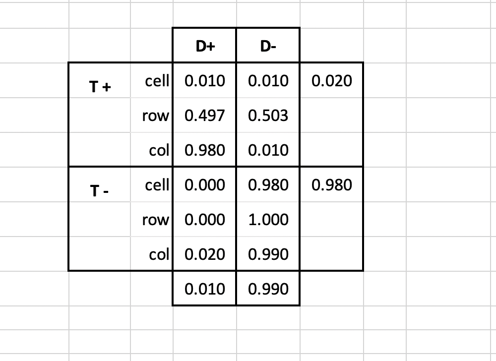
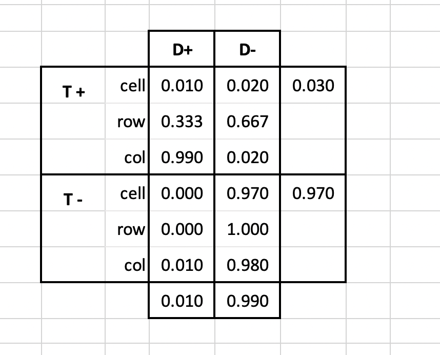

\raggedright
# NAME: **Olivia Park**

**NOTE:** The `.rmd` version of the file is available here: [(link)](https://tgstewart.cloud/midterm2.rmd)

## Instructions

Please prepare reponses/solutions for the following questions.

### Allowable resources

 You may use the solutions you've prepared for the prep questions during the exam.  You are welcome to use your homeworks, deliverables, or class notes.  You are permitted to access the internet for publicly available content.  You are not allowed to communicate with anyone via the internet or any other means during the exam. This includes, but is not limited to: 

* No messaging, emailing, or using social media to contact others. 
* No posting questions or seeking answers on forums, chat rooms, chat bots (including large language models like ChatGPT), or any collaborative platforms. 
* No sharing or discussing exam content with peers through any online or electronic medium.

You may **NOT** discuss any aspect of the exam or prep questions with anyone other than the instructor or TA.  You may **NOT** share code or documents.

### Submission instructions

1.  Within your course repo, create a folder called `Midterm2`
1.  Within the folder, create the script file `exam.rmd` with your solutions.  Create a rendered report in `.pdf` output.
1. Add, commit, and push to your repo on github.com.

## Questions

Exam questions are organized into sections cooresponding to the learning outcomes of the course.  

### Section 1. Tools of the data scientists

>Learning objective: Use the tools of data scientists

>Learning objective:  Implement best programming/coding practices

1.1 [5 pts] Write your name at the prompt above (line 6 in the script).

1.2 [5 pts] When you are done with the exam, please render this report as a pdf document.

\newpage

1.3 [5 pts] The following is a schematic of a project folder, with subfolders and files.

```
project
|
|---code
|       script.rmd
|
|---data
|       survey-responses.csv
|
|---docs
```

Supposing the `code` subfolder is the designated working directory, write the command to be included in the `script.rmd` file which will read the `survey-responses.csv` data, avoiding absolute file paths?

```{r, eval = FALSE}
survey <- read.csv("~/data/survey-responses.csv")
```

\newpage

### Section 2. Probability & Diagnostics

>Learning objective: Compare and contrast different definitions of probability, illustrating differences with simple examples

>Learning objective: Express the rules of probability verbally, mathematically, and computationally.

>Learning objective: apply cross table framework to the special case of binary outcomes


2.1 [5 pts] In a particular town, 1% of all individuals have a certain rare disease. There's a test for this disease that correctly identifies a sufferer 99% of the time (true positive rate) but also falsely identifies the disease in 2% of the healthy population (false positive rate). 

HINT: False positive rate = $P(T+|D-)$

Complete the following table of cell, row, and column probabilites based on the information about the prevalence, true positive rate, and false positive rate.  You are welcome to use an [excel spreadsheet (link)](https://tgstewart.cloud/prevalence-sensitivity-specificity.xlsx) which will automatically create the table for any combination of prevalence, sensitivity, and specificity.  (It might save time to insert a screen shot of the table rather than manually creating the table.)

|            |  Disease +  |  Disease -  |     |
|:-----------|:-----------:|:-----------:|:---:|
| Test +     |             |             |     |
| → cell     |             |   .0198          |  .000198   |
| → row      |     .99        |     .01        |     |
| → col      |             |    .02         |     |
| Test -     |             |             |     |
| → cell     |             |   .97          |     |
| → row      |             |             |     |
| → col      |             |     .98        |     |
|            |    .01         |    .99         |   1  |

set specificity to .98
set sensitivity to .99




\newpage

2.2 [5 pts] Suppose that a new test is developed and approved 98% true positive rate and 1% false positive rate.  As a consumer, which would you prefer?  Be specific about your reasoning and the quantities that you are using to make a decision.



\newpage

2.3 [10 pts] An audit of an email filtering system resulted in a dataset of 10000 emails, each manually verified as spam or not spam.  In addition to the type of email, the dataset indicates if the filter sent the email to the inbox or the junk folder.

The following command reads the dataset into memory.  From the data, generate an estimate of the positive predictive value and the negative predictive value of the spam filter.

HINT: Specificity in this example = $P(\text{Junk folder} | \text{Spam})$


```{r}
d1 <- readRDS(url("https://tgstewart.cloud/spam-data.RDS"))
table(d1)
```


\newpage

### Section 3. Simulation

>Learning objective: Use probability models to build simulations of complex real world processes to answer research questions

3.1 [5 pts] Consider two systems of three components (say A, B, and C).  In the first, a failure of any component leads to a failure of the entire system.  In the second, the components are redundent, and a failure only occurs if all three components fail.

```{r seqvspar, echo = FALSE}
pdf("seq-vs-par.pdf", width=10,height=5)
par(mfrow=c(1,2))
plot(c(-1,1),c(0,0), lwd = 10, type = "l", axes = FALSE, ylab = "", xlab = "", ylim = c(-1,1))
ps <- c(-.5,0,.5); ys <- rep(0,3)
points(ps,ys, cex = 10, pch = 16)
points(ps,ys, cex = 8, pch = 16, col = "white")
text(ps, ys, c("A","B","C"), cex = 3)
title(main = "Sequential", cex.main = 2)
box()

plot(c(-1,1),c(0,0), lwd = 10, type = "l", axes = FALSE, ylab = "", xlab = "", ylim = c(-1,1))
lines(c(-1,1),c(-.5,-.5), lwd = 10)
lines(c(-1,1),c(.5,.5), lwd = 10)
ps <- rep(0,3); ys <- 1:-1/2
points(ps,ys, cex = 10, pch = 16)
points(ps,ys, cex = 8, pch = 16, col = "white")
text(ps, ys, c("A","B","C"), cex = 3)
title(main = "Parallel", cex.main = 2)
box()
dev.off()
```


Suppose the failure time of an individual component is a random variable with the following distribution.

```{r histw, echo = FALSE}
par(mfrow = c(1,1))
hist(rweibull(10000,2,2), freq = FALSE, breaks = 100, main = "", xlab = "Years")
box()
```

The following function `sysfail` generates replicates of the time to system failure (years) for the sequential and parallel systems.  The input parameter `R` is the number of replicates that the fuction will return.

```{r}
sysfail <- function(R){
    A <- array(rweibull(R*3,2,2),dim = c(R,3))
    data.frame(sequential = apply(A,1,min), parallel = apply(A,1,max))
}
```

The following provides an estimate of how much longer the parallel system will last compared to the sequential system by simulating 25 different system failures.

```{r}
set.seed(230583)
a1 <- sysfail(25) 
a2 <- colMeans(a1)
diff(a2)
```

The calculated difference is based on pseudo-random data.  The process can be repeated many times.  The following code creates 1000 estimates.  The redline refers to the single estimate generated above.

```{r}
R <- 25
replicates <- replicate(1000, sysfail(R) |> colMeans() |> diff())
hist(replicates, breaks = 50, freq = FALSE, xlab = "Difference in failure time (years)"); box()
abline(v=diff(a2), lwd = 3, col = "red")
mean_reps <- mean(replicates <- replicate(1000, sysfail(R) |> colMeans() |> diff()))
abline(v=mean_reps, col = "blue")
```

Add to the figure blue reference line for the mean of the 1000 estimates.  (Simply edit the code chunk above.  You do not need to create a second copy.)


\newpage

3.2 [5 pts] What is the range (min and max) of the 1000 values you generated for the improved failure time estimate?

```{r}
#min and max
min(replicates)
max(replicates)
```


\newpage

3.3 [5 pts] What is the average absolute error of the 1000 estimates?  Use the mean calculated in 3.1 as the "true" value.

```{r}
absolute_error <- function(out, mean_reps){
  sum_of_error <- 0
  for(i in 1:length(out)){
    sum_of_error <- sum_of_error + abs(out[i] - mean_reps)
  }
  absolute_error <- sum_of_error / length(out)
}
abs_err <- absolute_error(replicates, mean_reps)

print(abs_err)
```


\newpage

3.4 [5 pts] What is the average relative error of the 1000 estimates?  Use the mean calculated in 3.1 as the "true" value.

```{r}
rel_err <- abs_err/mean_reps
print(rel_err)
```


\newpage

3.5 [5 pts] If you wanted to reduced the error by half, how many replicates (R) would you need to use?

you would want to use 100 replicates to half the error. 


\newpage

3.6 [5 pts] Generate a plot of overlapping histograms to show the difference between R=25 and your R from the previous problem.

```{r}
R2 <- 100 # Change this
replicates2 <- replicate(2000, sysfail(R2) |> colMeans() |> diff())

b1 <- seq(min(c(replicates,replicates2))-.1, max(c(replicates,replicates2))+0.1,by=0.02)
hist(replicates2, breaks = b1, col = "#ffabab50", freq = FALSE, main = "", xlim = range(replicates), xlab = "Difference in failure time (years)")
legend("topleft", legend = c(paste0("R=",R2),"R=25"), col = c("#ffabab50","#6488ea59"),bty = "n", pch = 15)
hist(replicates, breaks = b1, add=TRUE, col = "#6488ea59", freq = FALSE)
box()
```


\newpage

3.7 [5 pts] Calculate the average absolute error of the 1000 estimates generate with the new choice of R?  Did it change as you expected it to?

The absolute error is half with the new R, which is what we expected when we multiplied the R by 4. 

```{r}

mean_reps2 <- mean(replicates2)

absolute_error <- function(out, mean_reps2){
  sum_of_error <- 0
  for(i in 1:length(out)){
    sum_of_error <- sum_of_error + abs(out[i] - mean_reps)
  }
  absolute_error <- sum_of_error / length(out)
}
abs_err <- absolute_error(replicates2, mean_reps2)

print(abs_err)

```


\newpage

### Section 4. Confounding vs Causal Pathway

>Learning objective: define/describe confounding variables, Simpson's paradox, DAGs, and the causal pathway

4.1 [10 pts] The following function generates data from a cohort of individuals who agreed to be studied about heart disease.  In the dataset, there is exercise level at age 20 (below average, above average), blood pressure at age 25 (low, normal, high), and heart disease at age 30 (present, absent).

Generate 10000 draws from the function and create the cross table for exercise level and heart disease.  Calculate a summary of the effect of exercise by calculating the risk ratio:

\[
RR = \frac{P(\text{heart disease present}|\text{below average exercise})}{P(\text{heart disease present}|\text{above average exercise})}
\]
I t

```{r}
heart_data <- function(R){
    ex <- rbinom(R,1,.5)
    bp <- rnorm(R,-ex+1/2,1)
    bp <- cut(bp,c(-Inf,-1,1,Inf), labels = FALSE)
    hd <- 1*(rnorm(R,bp-3,1.8)>0)
    data.frame(
        exercise = factor(ex,0:1,c("below average","above average"))
      , blood_pressure = factor(bp,1:3,c("low","normal","high"))
      , heart_disease = factor(hd, 0:1, c("absent","present"))
    )
}


set.seed(20240329); d1 <- heart_data(1000000)

calc_delta <- function(df){
  num_ex <- 0
  ex_and_hd <- 0
  
  for(i in 1:nrow(df)){
    if(df[i,1] == "exsericise"){
      num_ex <- num_ex + 1
      if(df[i,3] == "heart disease"){
        vax_and_recov <- ex_and_hdv + 1
      }
    }
  }
  p_hd_given_ex = ex_and_hd / num_ex
  
  num_noex <- 0
  noex_and_nohd <- 0
  
  for(i in 1:nrow(df)){
    if(df[i,1] == "noexcerise"){
      num_noex <- num_noex + 1
      if(df[i,3] == "nohd"){
        noex_and_nohd <- noex_and_nohd + 1
      }
    }
  }
   p_hd_given_ex = ex_and_hd / num_ex
  
  delta = p_hd_given_ex - noex_and_nohd
}

Ra <- 1000
exer <- heart_data(Ra)

print(exer)

delta <- calc_delta(exer)
print(delta)

```


\newpage

4.2 [10 pts] Stratify the table by blood pressure.  As in the previous problem, calculate the same treatment effect in each strata.

```{r}


```


\newpage

4.3 [5 pts] Based on the summary of the treatment effect that you observed in the combined and stratified tables, is exercise associated with lower rates of heart disease?

It would depend on whether or not the values were postive or negative. 


\newpage

4.4 [5 pts] Which measure of treatment effect is most persuasive?  The combined estimate or the stratified estimates?  Which estimate(s) should you rely on?  Explain why, creating a DAG to represent relationship between the variables.

assuming the startfied tables reveal infomrtion, a DAG could look like:

Exersise amount --> Blood pressure (D) --> heart disease (R)
            |
            +-----------------------------------------------> heart disease (R)
